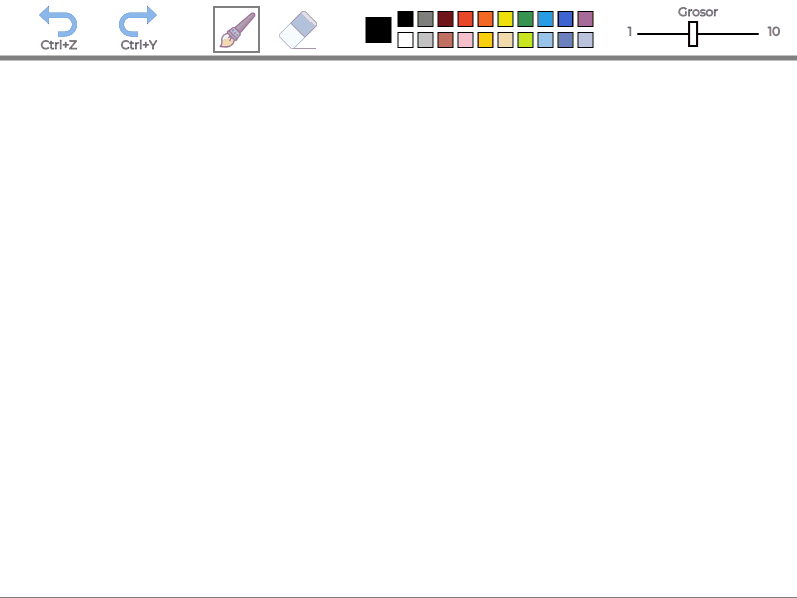
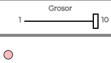
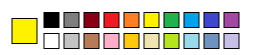
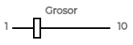
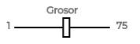

# Práctica 8 - Prototipo basado en Paint


## Memoria

### Autor

Kevin David Rosales Santana - <kevin.rosales101@alu.ulpgc.es>

### Índice

1. [Introducción](#1-introducción)
2. [Muestra del resultado](#2-muestra-del-resultado)
3. [Descripción del trabajo realizado](#3-descripción-del-trabajo-realizado)

   3.1 [Estructura de ficheros](#31-estructura-de-ficheros)
   
   3.2 [Decisiones en el desarrollo](#32-decisiones-en-el-desarrollo)
   
      - 3.2.1 [Pincel y goma](#321-pincel-y-goma)
      - 3.2.2 [Undo y redo](#322-undo-y-redo)
      - 3.2.3 [Colores](#323-colores)
      - 3.2.3 [Grosor](#323-grosor)
   
4. [Conclusión](#4-conclusión)
5. [Ejecución del Proyecto](#5-ejecución-del-proyecto)
6. [Referencias y herramientas utilizadas](#6-referencias-y-herramientas-utilizadas)

### 1. Introducción

En la presente práctica se pedía implementar un **prototipo basado en *Paint* que permitiera como mínimo modificar el grosor y el color del pincel**, sirviendo para el aprendizaje de *Processing*, el cual tiene como objetivo facilitar los desarrollos con fines creativos en entornos digitales. En esta práctica, se pedía a su vez **hacer uso de p5.js** ([ver referencia 5](#6-referencias-y-herramientas-utilizadas)), siendo esta una biblioteca *JavaScript* basada en el funcionamiento de *Processing* y orientada a la web ([ver página 159 de la referencia 1](#6-referencias-y-herramientas-utilizadas)).

En este repositorio se tiene la implementación de dicho prototipo, donde el usuario podrá realizar varios tipos de interacciones:

- Podrá **dibujar y borrar** el dibujo haciendo uso del [pincel y goma](#321-pincel-y-goma).
- Podrá **deshacer y rehacer** los cambios haciendo uso de opciones de [redo y undo](#322-redo-y-undo).
- Podrá **cambiar el color del pincel** haciendo uso de unos [colores disponibles](#323-colores)
- Podrá **cambiar el grosor del pincel** haciendo uso de un [*slider*](#323-grosor).

### 2. Muestra del resultado

<div align="center">
   </img>
   <p>Figura 1: Muestra de resultado</p>
</div>


Aunque no sea obligatorio, se muestra cómo luce visualmente.

### 3. Descripción del trabajo realizado

#### 3.1 Estructura de ficheros

Para realizar este trabajo, se ha creado este fichero (presente en la carpeta [Practica8](Practica8/)):

| Fichero     | Descripción                                                  |
| :---------- | :----------------------------------------------------------- |
| *sketch.js* | Fichero encargado de la **gestión del *Paint***. Al ser el fichero principal, gestiona el `setup()` y el `draw()` del proyecto haciendo uso una serie de funciones auxiliares. Es el encargado de dibujar la interfaz gráfica (menú de opciones) que se puede ver en la parte superior de la *Figura 1* y de gestionar los eventos de teclado y ratón (tanto para las opciones del menú como para dibujar/borrar). |

<div align="center">
   <p>Tabla 1: Estructura de ficheros</p>
</div>

#### 3.2 Decisiones en el desarrollo

A la hora de realizar el proyecto se ha tenido que tomar una serie de decisiones respecto al desarrollo de este. A continuación, se listarán dichas decisiones:

##### 3.2.1 Pincel y goma

**Para el pincel**, se trabaja con la función `line(x1, y1, x2, y2)` **para dar sensación de continuidad en los puntos detectados por *p5.js*** a la hora de arrastrar el ratón (en caso de no arrastrarlo y generar un único punto, se trata como tal con `point(x1, y1)`).

Así pues, como se mencionará posteriormente, **se trabaja sobre listas que almacenan los puntos por los que el ratón es arrastrado.** En cada `draw()`, estos puntos sirven como referencia para realizar las trazas que ve el usuario cuando dibuja. 

```javascript
function drawPointsList(pointsList){
  var firstPoint, secondPoint, onePoint;
  if (pointsList && pointsList.length > 1){
    for(var j = 0; j < pointsList.length - 1; j++){
      firstPoint = pointsList[j];
      secondPoint = pointsList[j+1];
      strokeWeight(firstPoint.strokeWeight);
      stroke(firstPoint.stroke);
      line(firstPoint.x, firstPoint.y, secondPoint.x, secondPoint.y);
    }
  }else if(pointsList && pointsList.length === 1){
    onePoint = pointsList[0];
    strokeWeight(onePoint.strokeWeight);
    stroke(onePoint.stroke);
    point(onePoint.x, onePoint.y);
  }
}
```

<div align="center">
   <p>Fragmento de código 1: Representación de puntos contenidos en una lista</p>
</div>

Es importante mencionar que los puntos **no solamente deben almacenar su ubicación (x, y)**, sino que deben almacenar **las características con las que fueron dibujados** (grosor de pincel `strokeWeight` y color `stroke`). Gracias a estos elementos, se podrá dibujar en cada `draw()` los puntos con las características del pincel que los generó (de otra manera, al cambiar el color/grosor del pincel, se cambiarían estas características en todos los puntos ya generados).

**Respecto a la "goma"**, funciona como **un pincel de color blanco con un rango de grosor más elevado.**

**A la hora de cambiar entre el pincel y la goma, se almacena el último grosor de ambos** para que el usuario, al volver a uno de ellos, mantenga el que tenía. Es necesario comentar que **el color, en el caso del pincel, también se almacena** (aunque a la hora de cambiar a la goma se comience a pintar en blanco).

Se ha realizado también **un puntero** en la zona del lienzo **con el color actual con una pequeña transparencia** de forma que el usuario tenga información en el mismo lienzo (sin recurrir al menú) sobre el color con el que se va a pintar. **El radio del puntero va en proporción con el grosor que se está utilizando:**

<div align="center">
   </img>
   <p>Figura 2: Puntero</p>
</div>

##### 3.2.2 *Undo* y *redo*

Cuando se trata de aplicaciones en general **es importante permitir al usuario rectificar los errores que puede llegar a cometer o volver a un estado previo a esta rectificación** y más cuando se trata de aplicaciones que permitan realizar al usuario un contenido dinámico como puede ser dibujar. Por ello, se propone como mejora estas opciones de *Undo* (deshacer) y *Redo* (rehacer). 

Para realizar esta labor, resulta fundamental **gestionar tres tipos de listas distintas.** En el caso del código utilizado, estas listas tienen el nombre de `pointsLists`, `currentPointsList`, `redoPointsLists`. Su funcionamiento se expone a continuación:

| Nombre de la lista  | Funcionamiento                                               |
| :-----------------: | :----------------------------------------------------------- |
|    `pointsLists`    | **Es una lista de listas de puntos.** Teniendo en cuenta que cada traza (conjunto de puntos realizados antes de dejar de arrastrar el ratón pulsado o salir del lienzo) es almacenada en una misma lista, **cada lista de puntos presente en esta variable contiene una traza distinta.** Todas las listas contenidas son las dibujadas en el `draw()`. **Cuando se realiza un `undo`, se elimina la última lista de puntos de esta lista y se transfiere a `redoPointsLists`.** |
| `currentPointsList` | **Es una lista de puntos.** Su funcionamiento es almacenar el contenido actual que está siendo dibujado (**la traza actual**) antes de que el usuario deje de arrastrar el ratón pulsado y se dé por concluido este. El `draw()` debe encargarse de dibujar los puntos de esta lista para que el usuario pueda visualizar lo que está dibujando en la traza actual. **Cuando el usuario deja de arrastrar el ratón pulsado o sale de los márgenes del lienzo, la traza se da por acabada y se une a `pointsLists`.** |
|  `redoPointsLists`  | **Es una lista de listas de puntos que han sido borrados mediante un *undo*. **Como *Paint* realiza actualmente, debe ser vaciada cada vez que se dibuja un nuevo punto, de lo contrario podría tener un mal funcionamiento. |

<div align="center">
   <p>Tabla 2: Definición de tipos de listas de puntos</p>
</div>

Para la comodidad del usuario, se le permite permite **realizar las acciones de deshacer y rehacer mediante la propia interfaz** (haciendo *click* encima de estos elementos en el menú) **o mediante el teclado** (mediante las combinaciones habituales *Ctrl + Z* para deshacer y *Ctrl + Y* para rehacer).

##### 3.2.3 Colores

**Para los colores**, se optó por implementar una interfaz parecida al *Paint*:

<div align="center">
   </img>
   <p>Figura 3: Colores disponibles</p>
</div>

En donde el usuario **puede observar el color que está utilizando en un cuadrado de más tamaño situado en la parte izquierda** mientras puede observar los colores disponibles en cuadrados de menor tamaño a su derecha. Para seleccionar el color, se debe pulsar en uno de estos. **Esta acción provocará que el color seleccionado cambie y, en caso de estar en modo pincel, el color actual lo haga en consecuencia:**

```javascript
function manageColors(){
  for(var i = 0; i < 10; i++){
    if (mouseX > i*0.025*width + 0.5*width && mouseX < i*0.025*width + 0.5*width + 15 &&
        mouseY > 0.0225*height && mouseY < 0.0225*height + 15){
      selectedColor = i;
      if (!eraserMode) myStroke = availableColors[selectedColor];
    }else if (mouseX > i*0.025*width + 0.5*width && mouseX < i*0.025*width + 0.5*width + 15 && mouseY > 0.0575*height && mouseY < 0.0575*height + 15){
      selectedColor = i+10;
      if (!eraserMode) myStroke = availableColors[selectedColor];
    }
  }
}
```

<div align="center">
   <p>Fragmento de código 2: Gestión del cambio de color</p>
</div>

Para más información de cómo se almacena el color de cada punto dibujado, se recomienda ver el apartado relacionado a la gestión del [pincel y goma](#321-pincel-y-goma).

##### 3.2.4 Grosor

**Para el grosor**, se implementó **un *slider*** con el cual se puede seleccionar el que se desee.

|                   *Slider* en modo pincel                    |                  *Slider* en modo borrador                   |
| :----------------------------------------------------------: | :----------------------------------------------------------: |
|  |  |

<div align="center">
   <p>Tabla 3: Comparación de <i>sliders</i> para seleccionar grosor de pincel o goma</p>
</div>
Como se mencionó al hablar del [pincel y goma](#321-pincel-y-goma), **el grosor de la goma comprende un rango más elevado**. Se debió diseñar un sistema para que a la hora de arrastrar el ratón pulsado cuando se dibujaba, en caso de que se siguiera arrastrando por la zona del *slider*, no cambiara el grosor. De esta manera, se obliga al usuario a tener que hacer un primer *click* en la zona del slider (no necesariamente en la barra vertical que indica el grosor actual) antes de poder cambiar el grosor mediante el arrastre del ratón pulsado.

**La posición de la barra vertical en el *eje X* se escala haciendo uso de `map(...)` para que el valor de `strokeWeight` varíe entre los valores mostrados por pantalla** ([1-10] con el pincel y [1-75] en el borrador):

```javascript
function changeStrokeWidthBarPosition(mode){
  if (mouseX > 0.795*width && mouseX < 0.95*width && 
      mouseY > 0.03*height && mouseY < 0.09*height)
    if (mode || allowDragStrokeWeightBar){
      if(!eraserMode) myStrokeWeightBrush = map(mouseX, 0.795*width, 0.95*width, 1, 10)
      else myStrokeWeightEraser = map(mouseX, 0.795*width, 0.95*width, 1, 75)
      allowDragStrokeWeightBar = true;
    }
}
```

<div align="center">
   <p>Fragmento de código 3: Gestión del cambio de grosor mediante el <i>slider</i></p>
</div>


### 4. Conclusión

Esta práctica ha servido una vez más como **aprendizaje para *Processing* (usando la biblioteca *JavaScript* p5.js)** y, además, se ha tratado de una práctica muy entretenida donde se ha tenido contacto con una herramienta que sirve para aprender diferentes formas y utilidades que permiten interactuar con un lienzo.

*Processing* para ello otorga una serie de funciones muy útiles y con cometidos muy distintos que permiten realizar tareas tan variadas como la que se puede observar en este repositorio. Se ha podido observar cómo el uso de *p5.js* [(ver referencia 5)](#6-referencias-y-herramientas-utilizadas) puede resultar fundamental **a la hora de hacer tareas relacionadas con la web o de facilitar que el usuario pueda usar aplicaciones usando elementos de su vida diaria, como pueden ser los navegadores.**

Por último, se debe recalcar que gracias a esta octava práctica de *Creando Interfaces de Usuario*, se ha podido aprender a desarrollar una práctica donde **la interacción del usuario vuelve a ser una de las claves más importantes en el diseño y desarrollo de aplicaciones y donde se debe tratar de otorgar la mayoría de facilidades disponibles al usuario final.**

### 5. Ejecución del proyecto

Para ejecutar este proyecto sin tener que descargar la biblioteca, tener un editor y un servidor web, **se puede usar desde este [enlace](https://editor.p5js.org/kevinrosalesdev/present/lvy0W0WaZ).**

### 6. Referencias y herramientas utilizadas

- [1] Modesto Fernando Castrillón Santana, José Daniel Hernández Sosa. [Creando Interfaces de Usuario. Guion de Prácticas.](https://cv-aep.ulpgc.es/cv/ulpgctp20/pluginfile.php/126724/mod_resource/content/25/CIU_Pr_cticas.pdf)
- [2] Processing Foundation. [Processing Reference.](https://processing.org/reference/)
- [3] Processing Foundation. [Processing Download.](https://processing.org/download/)
- [4] Extrapixel. [GifAnimation Processing Library.](https://github.com/extrapixel/gif-animation)
- [5] Lauren McCarthy. [p5.js](https://p5js.org/)
- [6] Icons8 LLC. [Iconos del menú utilizados.](https://icons8.com/icons)
- [7] Font Squirrel. [Fuente utilizada (*Montserrat Regular*).](https://icons8.com/)
- [8] Nicke Manarin. [ScreenToGif.](https://www.screentogif.com/)

